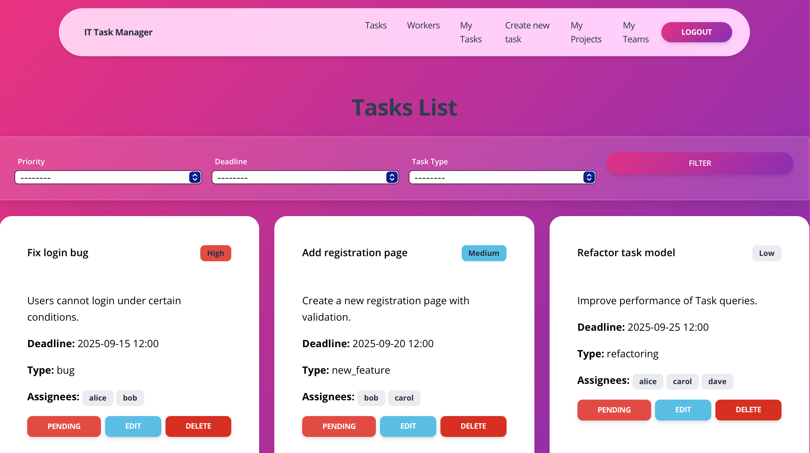

# IT-Task-Manager

> A simple task manager built with Django to manage teams, projects, and tasks.  


## Check it out!

[IT Task manager deployed to Render](https://it-task-manager-wcfb.onrender.com)

For demonstration purposes, two user accounts have been created so you can explore the application from different perspectives:

- **Developer**  
  - Username: `michael_developer`  
  - Password: `MichaelDev@2025!`  
  - With this account, you can check which projects and teams the developer is part of, as well as see the interface from a regular worker’s point of view.

- **Project Manager**  
  - Username: `john_project_manager`  
  - Password: `JohnProjMgr#2025!`  
  - This account allows you to explore the Project Manager’s panel. You can create teams, projects, and tasks here.  

There are also other roles available in the system, but their interface looks the same as the developer’s.

## Instalation

Python3 must be already installed

```shell
git clone https://github.com/Michal-Naron/it-task-manager.git
cd it-task-manager
python3 -m venv venv
source venv/bin/activate
pip3 install -r requirements.txt
python3 manage.py runserver
```


## Creating a User
Go to the registration page and fill out the form to create a new account. After that, you can log in using your credentials.


## Features
* Authentication system for Worker/Users 
* Task management with priorities, deadlines & status tracking  
* Projects & Teams support for better organization  
* Only Project Managers can create Projects and Teams, others can participate in them  
* Filtering & searching tasks by priority, deadline or type  
* Worker profiles with position, email & avatar  
* Clean responsive Bootstrap-based interface
* Powerful admin panel for advanced managing

## Demo
